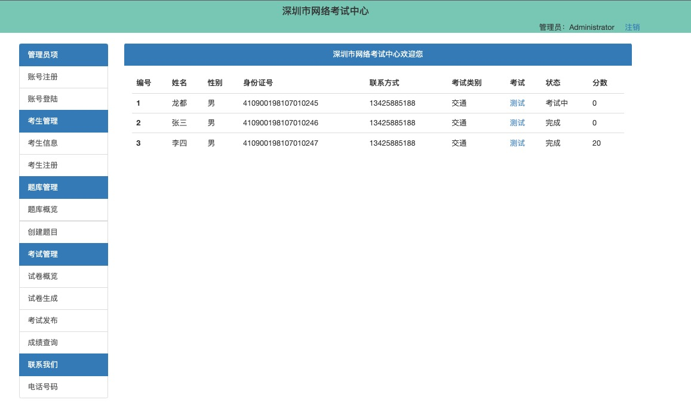
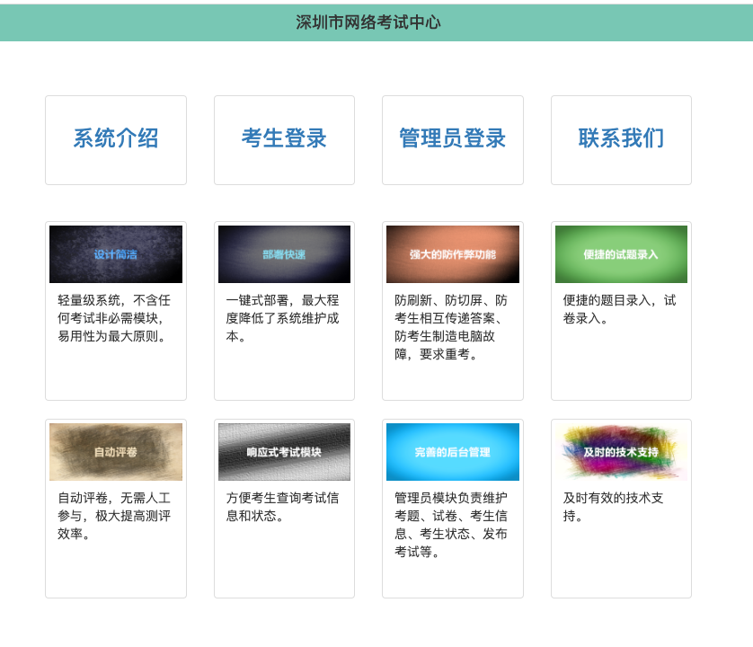

# 网络在线考试系统

基于Golang Web框架[Revel](https://revel.github.io/)开发的一整套线上考试系统, 欢迎fork使用\
作者： 一小撮坏分子



## 功能：

1. 用户管理
2. 考生信息注册
3. 试卷题目上传
4. 考生考试试卷随机生成
5. 考生考试试卷指定
6. 考试
7. 阅卷
8. 评分
9. 查分
10. 查看考生历史试卷记录
11. 考生信息删除

# 开发指引

## 技术依赖

1. Golang 版本 1.20
2. MongoDB 版本 6.0
3. [Bootstrap 3.3](https://getbootstrap.com/docs/3.3/)

## MAC电脑：

1. 参考[安装文档](https://go.dev/doc/install)安装Golang以及配置好本地Golang环境变量GOROOT和GOPATH。
2. 参考[Revel tutorial](https://revel.github.io/tutorial/gettingstarted.html)安装Revel框架。 
3. 参考[社区版mongodb 6.0安装文档](https://www.mongodb.com/docs/manual/tutorial/install-mongodb-on-os-x/#installing-mongodb-6.0-edition-edition))
安装MongoDB数据库。
4. 克隆[examsystem](https://github.com/YiXiaoCuoHuaiFenZi/examsystem)到本地GOPATH目录。

启动本地MongoDB数据库, `~/mongodb-data/` 是数据库数据存放目录，你可以设置成你自己的想要的路径目录。

```shell
mongod --dbpath ~/mongodb-data/
```

app.conf中已经配置好本地缺省的MongoDB uri地址，如果你想链接其他地址的MongoDB数据库，请在app.conf中修改下面配置

```shell
[db] 
uri = mongodb://localhost:27017
```

配置管理员账号信息：app.conf(/examsystem/conf/app.conf)文件中的[administrator]节点，此账号是超级管理员级别，可以登录后创建别的管理员账号。

```shell
[administrator]
id_card = 533467199012268897 # 超级管理员账号，部署系统的时候配置上去就可以直接使用，此账号可以创建别的管理员账号
password = 00002583 # 超级管理员账号密码
```

终端进入项目所在目录的父目录执行下面命令启动本地服务：

```shell
revel run examsystem
```

浏览器中打开[http://localhost:9000/](http://localhost:9000/)进入系统首页\


## Windows电脑：

依赖和步骤跟MAC一致，执行命令终端换成Windows命令行即可。

## 加微信技术支持


